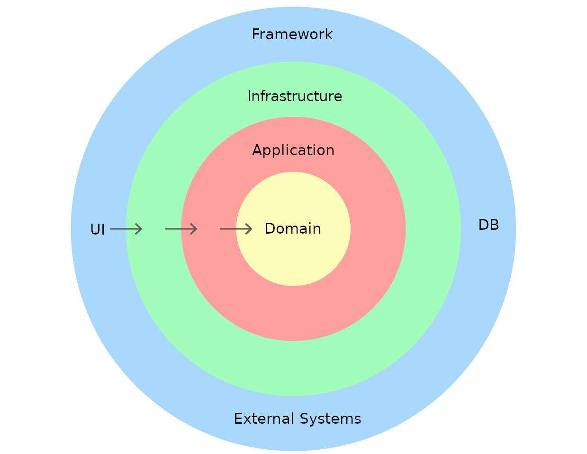

# Laravel & Domain-Driven Design
This is a very opinionated domain-drive design template for Laravel projects.

## What is Domain-Drive Design?
Domain-Driven Design (DDD) is a software design approach that focus on modeling the software to match the domain (area of expertise).  
The objective of DDD is to align the software with the business needs and terminology used by the domain experts, users, and stakeholders, creating a model that has a rich understanding of the processes and rules of a domain.

[Here's](https://romanglushach.medium.com/domain-driven-design-ddd-a-guide-to-building-scalable-high-performance-systems-5314a7fe053c) a good article about DDD.

## DDD Layers



In projects following DDD, the most common layer division is `Domain`, `Application`, `Presentation`, `Infrastructure` where:

* `Domain` is the layer where all business rules related to the problem to be solved are included.  
Decoupled from other layers or concerns of application, it is here where all business rules related to the problem to be solved are included.
* `Application` is the layer where the business process flows are handled and it acts as a mediator between the user interface layer and the domain layer, orchestrating the use cases and scenarios that the system supports.
* `Presentation` is the layer where interaction with external systems happens, presenting the system to users and handling their interactions.
* `Infrastructure` is the layer that accesses external services such as database, messaging systems and email services.


## This Boilerplate Approach
```
├── Core
│   ├── Application
│   │   ├── Console
│   │   │   └── Kernel.php
│   │   ├── Exceptions
│   │   │   └── Handler.php
│   │   └── Providers
│   │       └── AppServiceProvider.php
│   └── Domain
│       └── Models
│           └── User.php
└── External
    ├── Http
    │   └── Middleware
    │       ├── Authenticate.php
    │       ├── EncryptCookies.php
    │       ├── PreventRequestsDuringMaintenance.php
    │       ├── RedirectIfAuthenticated.php
    │       ├── TrimStrings.php
    │       ├── TrustHosts.php
    │       ├── TrustProxies.php
    │       ├── ValidateSignature.php
    │       └── VerifyCsrfToken.php
    ├── Infrastructure
    │   └── Providers
    │       ├── AuthServiceProvider.php
    │       ├── EventServiceProvider.php
    │       └── RouteServiceProvider.php
    └── Web
        └── Http
            ├── Controllers
            │   └── Controller.php
            └── Kernel.php
```

## Models and custom folder structures

To create a new model using this folder structure we use the `php artisan make:model` command and provide the path to the models folder like so:
`` php artisan make:model Core/Domain/Models/NewModel``

Using a factory is possible with custom folders, but the model will have to implement the following method: 
```
protected static function newFactory()
{
    return new ModelFactory();
}
```
The method was added to the make:model, but feel free to remove it if the model does not require a factory. 
